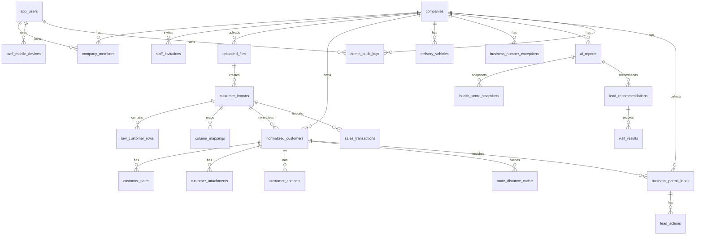

# MAJU Current State

작성일: 2026-08-19  
분석 기준: 현재 저장소 코드(`app`, `components`, `lib`, `supabase`)  
목적: 다른 AI 또는 개발자가 MAJU의 현재 구현 상태를 처음부터 파악하기 위한 기준 문서  

## 0. 확인 범위와 표기 기준

### 확인한 주요 파일

- 메뉴/쉘: `lib/customer-navigation.ts`, `components/customer-app-shell.tsx`, `components/map-home-view.tsx`
- 고객사 화면: `app/dashboard/page.tsx`, `app/page.tsx`, `app/crm/timeline/page.tsx`, `app/crm/summary/page.tsx`, `app/customers/data/page.tsx`
- 지도/코스: `components/kakao-address-map.tsx`, `components/sales-route-map-workspace.tsx`, `lib/route-map-markers.ts`, `app/map/fullscreen/page.tsx`
- 매출/리포트/AI: `app/revenue/pipeline/page.tsx`, `app/revenue/transactions/page.tsx`, `app/assistant/page.tsx`, `app/reports/[id]/page.tsx`, `lib/analysis.ts`
- 모바일: `app/mobile/join/page.tsx`, `app/mobile/today/page.tsx`, `app/mobile/register/page.tsx`
- 관리자: `app/admin/page.tsx`, `app/admin/companies/page.tsx`, `app/admin/uploads/page.tsx`, `app/admin/accounts/page.tsx`, `app/admin/system/page.tsx`
- API/데이터: `lib/store.ts`, `lib/auth.ts`, `lib/workspace.ts`, `lib/sample-data.ts`, `supabase/schema.sql`, `supabase/migrations/*.sql`
- 외부 API: `lib/tmap.ts`, `lib/localdata.ts`, `lib/leads.ts`, `lib/google-reviews.ts`, `lib/business-status.ts`, `lib/opinet.ts`, `lib/place-links.ts`

### 구현 상태 기준

| 상태 | 의미 |
|---|---|
| 완료 | UI, API, DB 저장 또는 실제 외부 API 호출까지 연결됨 |
| 부분 구현 | 주요 UI/API/DB 일부는 있으나 흐름 일부가 fallback, 수동, 조건부, 또는 제한적 |
| UI만 구현 | 화면 요소는 있으나 실제 저장/연동 근거가 약함 |
| 미구현 | 코드에서 명확한 구현을 확인하지 못함 |

### 중요 주의

- 이 문서는 현재 상태만 기록한다. 개선 제안은 작성하지 않는다.
- “추정”이라고 표시한 항목은 코드 구조와 화면 문구에서 유추한 내용이다.
- Supabase 환경변수가 없거나 테이블이 없는 경우 다수 기능은 `sampleCustomers`, empty payload, fallback 상태로 동작한다.

---

## 1. 서비스 개요

### 현재 서비스가 해결하려는 문제

현재 코드 기준 MAJU는 B2B 유통/현장 영업사가 거래처 정보를 등록하고, 지도 기반으로 거래처 위치·배송/방문 코스·매출 현황·영업 후보를 관리하도록 돕는 운영 플랫폼이다.

구체적으로 해결하려는 문제는 다음과 같다.

- ERP별로 다른 거래처/매출 엑셀 양식을 표준 필드로 매핑해 등록한다.
- 거래처의 사업자 정보, 주소, 담당자, 배송 정보, 첨부자료, 메모 이력을 한 원장으로 관리한다.
- 회사 출발지와 거래처 주소를 기준으로 지도 마커와 이동거리/시간을 계산한다.
- 배송차/담당자 기준으로 거래처를 필터링하고 코스를 확인한다.
- 매출 거래내역을 업로드해 매출 기회, 이탈 징후, 거래처 상태를 파악한다.
- 사업자 인허가 신규 데이터를 기반으로 신규 영업 리드를 수집하고, 전화/DM/방문 액션을 기록한다.
- 관리자 화면에서 고객사 계정, 업로드, 시스템 연결 상태를 점검한다.

### 주요 사용자

| 사용자 | 코드 기준 역할 |
|---|---|
| MAJU 관리자 | `/admin/*`에서 고객사, 계정, 업로드, 시스템 상태 관리 |
| 고객사 대표/관리자 | 지도 홈, 거래처, 매출, 회사 설정, 직원 초대 관리 |
| 배송기사/영업직원/현장직원 | 모바일 `/mobile/today`, `/mobile/register`에서 오늘 코스, 현장 기록, 사진 업로드 |
| 개인 사용자 | 카카오/네이버/구글 OAuth로 개인 워크스페이스 생성 가능 |

추정: 핵심 유료 고객은 식자재/유통/납품 회사의 대표 또는 운영 관리자이며, 현장 직원은 모바일로 보조 사용한다.

### 현재 구현된 핵심 기능

- 고객사 로그인/관리자 로그인
- 회사별 거래처 원장 조회/등록/수정
- 엑셀 업로드와 필드 매핑
- 매출 거래내역 업로드 및 매칭
- 지도 홈과 카카오맵 기반 마커 표시
- TMAP 기반 거리/경로 계산 API
- 배송차/담당자/등급 기준 필터링
- 거래처 상세 메모/첨부자료/담당자/리뷰 요약 관리
- 사업자 상태 조회(NTS API 조건부)
- 사업자 인허가 신규 리드 업로드/자동 수집(LocalData API 조건부)
- 신규 리드 액션 기록/거래처 전환 API
- 모바일 오늘 코스/배송 완료/적재위치 기록 UI
- 관리자 고객사/계정/업로드/시스템 점검

### 서비스 전체 사용 흐름

1. 관리자 또는 고객사가 로그인한다.
2. 회사 설정에서 회사명, 출발지, 직원, 사업자번호 예외 등을 설정한다.
3. 거래처 기본정보를 수기 등록하거나 엑셀로 업로드한다.
4. 매출 거래내역을 업로드하고 거래처와 매칭한다.
5. 지도 홈에서 거래처 위치, 배송차, 담당자, 코스, 거리/시간을 확인한다.
6. 거래처 관리 화면에서 상세 정보, 첨부자료, 메모, 사업자 상태, 리뷰 요약을 관리한다.
7. 신규 인허가 리드를 업로드/수집해 전화/DM/방문 액션을 기록한다.
8. 매출 기회, AI 리포트, 영업 도우미 화면에서 후속 액션을 확인한다.
9. 모바일 직원은 오늘 코스와 현장 기록을 처리한다.

### 현재 서비스 구조에서 추론되는 제품 방향

추정: MAJU는 단순 CRM보다 “지도 기반 영업/배송 운영 OS” 방향으로 이동 중이다. 기존 거래처 관리는 기반 데이터이고, 메인 경험은 지도에서 거래처·코스·신규 리드·영업 액션을 한 번에 보는 구조로 정리되고 있다.

---

## 2. 전체 메뉴 구조(IA)

### 고객사 메뉴

`lib/customer-navigation.ts` 기준.

- 지도 OS
  - 지도 홈
- 거래처
  - 거래처 전체 현황
  - 데이터 등록
  - 거래처 관리
  - 저장 이력
- 매출
  - 매출 기회
  - 매출 거래내역
  - 영업 도우미
  - 운영 리포트
- 관리
  - 회사 설정

| 메뉴 | 목적 | 주요 기능 | 연결되는 메뉴 | 구현 상태 |
|---|---|---|---|---|
| 지도 홈 | 지도 중심 운영 화면 | 거래처 마커, 배송차/등급 필터, 코스, KPI, 신규 리드 접근 | 거래처 관리, 데이터 등록, 매출, 리포트 | 부분 구현 |
| 거래처 전체 현황 | 전체 거래처 요약 | 거래처 수, 보완 상태, 운영 요약, 상세 이동 | 거래처 관리, 데이터 등록 | 부분 구현 |
| 데이터 등록 | 거래처/매출 입력 | 엑셀 업로드, 수기 등록, 헤더 매핑, OCR, 저장 결과 | 저장 이력, 거래처 관리, 지도 홈 | 부분 구현 |
| 거래처 관리 | 거래처 원장 | 목록, 상세, 편집, 메모, 첨부, 사업자 상태, 리뷰 | 지도 홈, 매출 거래내역 | 부분 구현 |
| 저장 이력 | 업로드/저장 상태 확인 | 업로드 히스토리, 저장 여부, 품질 상태 | 데이터 등록 | 부분 구현 |
| 매출 기회 | 매출 후보/파이프라인 | 예상매출, 상태별 후보, 후속 영업 대상 | 거래처 관리, 매출 거래내역 | 부분 구현 |
| 매출 거래내역 | ERP 매출 원장 조회 | 매출 행, 거래처 매칭, 분석 | 매출 기회, 거래처 관리 | 부분 구현 |
| 영업 도우미 | 영업 문안/후속 액션 | 견적/메모/후속 액션 초안 | 거래처 관리, 매출 기회, 지도 홈 | UI만 구현에 가까운 부분 구현 |
| 운영 리포트 | 회사 건강도/AI 리포트 | Health Score, 지역/업종/리드 추천 | 지도 홈, 매출, 거래처 | 부분 구현 |
| 회사 설정 | 회사/직원/출발지 설정 | 회사명, 출발지, 직원 초대, 사업자번호 예외 | 모바일, 지도 홈 | 부분 구현 |

### 관리자 메뉴

`app/admin/admin-page-header.tsx` 기준.

- 운영 현황
- 고객사 관리
- 업로드·분석
- 전역 계정
- 시스템 점검

| 메뉴 | 목적 | 주요 기능 | 연결되는 메뉴 | 구현 상태 |
|---|---|---|---|---|
| 운영 현황 | MAJU 관리자 콘솔 홈 | 고객사/업로드/리드/시스템 요약 | 고객사 관리, 업로드, 시스템 | 부분 구현 |
| 고객사 관리 | 고객사/직원 계정 운영 | 고객사 생성/수정, 직원 초대/역할 표시 | 고객사 미리보기, 전역 계정 | 부분 구현 |
| 업로드·분석 | 업로드 품질 확인 | 업로드 이력, 이슈 요약, 회사별 품질 | 고객사 관리, 시스템 | 부분 구현 |
| 전역 계정 | 관리자/기본 고객사 계정 설정 | 관리자/고객사 로그인 정보 관리 | 고객사 관리 | 부분 구현 |
| 시스템 점검 | 배포/DB/외부 API 상태 확인 | 환경변수, Supabase, Storage, TMAP/Kakao/NTS 상태 | 업로드, 고객사 | 부분 구현 |

### 모바일 메뉴

`app/mobile/today/page.tsx`, `app/mobile/register/page.tsx` 기준.

- 코스
- 거래처
- 등록
- 기록

| 메뉴 | 목적 | 주요 기능 | 연결되는 메뉴 | 구현 상태 |
|---|---|---|---|---|
| 코스 | 오늘 현장 방문/배송 코스 확인 | 방문처, 거리, 시간, 선택 거래처 | 거래처, 기록 | 부분 구현 |
| 거래처 | 선택된 거래처 상세 확인 | 주소, 연락처, 적재위치, 배송완료 | 코스, 기록 | 부분 구현 |
| 등록 | 모바일 현장 거래처 등록 | 모바일 등록 워크스페이스 | 코스 | 부분 구현 |
| 기록 | 현장 방문/배송 기록 | 방문 메모, 배송 증빙, 적재위치 사진 | 거래처 | 부분 구현 |

---

## 3. 화면별 상세 분석

### 3.1 지도 홈

| 항목 | 내용 |
|---|---|
| 화면명 | 지도 홈 / MAJU Map OS |
| 경로 | `/dashboard` |
| 파일 | `app/dashboard/page.tsx`, `components/sales-route-map-workspace.tsx`, `components/customer-app-shell.tsx` |
| 화면 목적 | 거래처 위치, 영업·배송 코스, 배송차/등급 필터, KPI를 지도 중심으로 확인 |
| 현재 표시 정보 | 거래처 수, 배송차량, 매출합, 출발지 기준 거리/시간, 지도, 거래처 목록, 배송담당자/차량 필터, 코스 계산 패널 |
| 사용자 행동 | 지도 마커 클릭, 거래처 선택, 필터 변경, 배송차 선택, 코스 계산, 큰 지도 열기, 거래처 상세/편집 패널 열기 |
| 주요 컴포넌트 | `CustomerAppShell`, `SalesRouteMapWorkspace`, `KakaoAddressMap` |
| 연결 관계 | 거래처 관리, 데이터 등록, 회사 설정, 매출, 리포트 |
| 사용하는 데이터 | `getCompanySettings`, `getTodayRoutePlan`, `getCustomerMaster`, `getCompanyOriginAddress`, `getChurnRiskCustomers`, `getDeliveryVehicleFuelTypes` |
| 구현 상태 | 부분 구현 |

### 3.2 데이터 등록

| 항목 | 내용 |
|---|---|
| 화면명 | 데이터 등록 |
| 경로 | `/` |
| 파일 | `app/page.tsx`, `components/excel-mapping-preview.tsx`, `components/data-registration-report.tsx`, `components/customer-workspace-tabs.tsx` |
| 화면 목적 | 거래처 마스터와 매출 거래내역을 수기/엑셀/OCR 방식으로 등록 |
| 현재 표시 정보 | 등록 유형, 엑셀 미리보기, 헤더 매핑, 품질 체크, 저장 결과, OCR 업로드, 사업자 검색, 외부 지도 링크 |
| 사용자 행동 | 파일 업로드, 매핑 설정, 프리셋 저장/삭제, 수기 등록, OCR 파일 업로드, 분석 저장 |
| 주요 컴포넌트 | `ExcelMappingPreview`, `DataRegistrationReport`, 내부 등록 UI |
| 연결 관계 | 거래처 관리, 지도 홈, 저장 이력, 관리자 시스템 |
| 사용하는 데이터 | `/api/analyze`, `/api/customers`, `/api/ocr/business-license`, `/api/business-search`, `/api/excel-mapping-presets`, `/api/upload-history` |
| 구현 상태 | 부분 구현 |

### 3.3 거래처 전체 현황

| 항목 | 내용 |
|---|---|
| 화면명 | 거래처 전체 현황 |
| 경로 | `/crm/summary` |
| 파일 | `app/crm/summary/page.tsx` |
| 화면 목적 | 전체 거래처 보유 현황과 보완 상태 요약 |
| 현재 표시 정보 | 고객 수집 결과, source 상태, 거래처 요약, 운영 요약 |
| 사용자 행동 | 거래처 선택/상세 이동, 보완 필요 항목 확인 |
| 주요 컴포넌트 | `CustomerAppShell` |
| 연결 관계 | 거래처 관리, 데이터 등록 |
| 사용하는 데이터 | `/api/customer/history-status`, `/api/customers`, `/api/customer-operations/summary` |
| 구현 상태 | 부분 구현 |

### 3.4 거래처 관리

| 항목 | 내용 |
|---|---|
| 화면명 | 거래처 관리 / 거래처 히스토리 |
| 경로 | `/crm/timeline` |
| 파일 | `app/crm/timeline/page.tsx`, `components/customer-attachment-upload-panel.tsx` |
| 화면 목적 | 거래처 원장 상세, 편집, 메모, 첨부자료, 운영 이력 관리 |
| 현재 표시 정보 | 거래처 목록, 필터, 상세 정보, 사업자번호, 대표자, 연락처, 주소, 배송권역/담당자/배송차, 첨부자료, 메모, 리뷰, 담당자 연락처 |
| 사용자 행동 | 검색/필터, 거래처 선택, 상세 편집, 주소 검색, 사업자 상태 조회, 첨부 업로드, 메모 추가, 중복 병합, 담당자 일괄 변경 |
| 주요 컴포넌트 | `WorkspaceSectionNav`, 내부 상세/편집 패널, `CustomerAttachmentUploadPanel` |
| 연결 관계 | 지도 홈, 매출 거래내역, 데이터 등록 |
| 사용하는 데이터 | `/api/customers`, `/api/customer-operations`, `/api/customer-attachments/upload`, `/api/address-search`, `/api/customer/business-status`, `/api/customers/merge`, `/api/customers/bulk-manager`, `/api/customers/bulk-vehicle` |
| 구현 상태 | 부분 구현 |

### 3.5 저장 이력

| 항목 | 내용 |
|---|---|
| 화면명 | 저장 이력 / 데이터 관리 |
| 경로 | `/customers/data` |
| 파일 | `app/customers/data/page.tsx` |
| 화면 목적 | 업로드 및 저장 상태 확인 |
| 현재 표시 정보 | 업로드 이력, 저장 여부, 품질 점수, 상태 |
| 사용자 행동 | 업로드 이력 조회 |
| 주요 컴포넌트 | `CustomerAppShell` |
| 연결 관계 | 데이터 등록, 관리자 업로드 |
| 사용하는 데이터 | `/api/upload-history` |
| 구현 상태 | 부분 구현 |

### 3.6 매출 기회

| 항목 | 내용 |
|---|---|
| 화면명 | 매출 기회 |
| 경로 | `/revenue/pipeline` |
| 파일 | `app/revenue/pipeline/page.tsx` |
| 화면 목적 | 매출 기회, 이탈/성장 후보, 상태별 영업 후보 확인 |
| 현재 표시 정보 | 예상매출, 전환율, 방문/원장 연결 기준, 후보 테이블 |
| 사용자 행동 | 관련 화면 이동, 후보 확인 |
| 주요 컴포넌트 | `CustomerAppShell`, `WorkspaceSectionNav` |
| 연결 관계 | 거래처 관리, 매출 거래내역, 지도 홈 |
| 사용하는 데이터 | `getRevenuePipeline` |
| 구현 상태 | 부분 구현 |

### 3.7 매출 거래내역

| 항목 | 내용 |
|---|---|
| 화면명 | 매출 거래내역 |
| 경로 | `/revenue/transactions` |
| 파일 | `app/revenue/transactions/page.tsx`, `components/sales-transaction-table.tsx`, `components/sales-transaction-matcher.tsx` |
| 화면 목적 | ERP 매출 원장 조회 및 거래처 매칭 |
| 현재 표시 정보 | 매출액, 행 수, 거래처 수, 매칭 상태, 품목/거래처 분석, 최근 원장 행 |
| 사용자 행동 | 날짜 필터, 거래처 매칭 |
| 주요 컴포넌트 | `SalesTransactionTable`, `SalesTransactionMatcher`, `WorkspaceSectionNav` |
| 연결 관계 | 매출 기회, 거래처 관리 |
| 사용하는 데이터 | `getSalesTransactions`, `/api/revenue/transactions/match` |
| 구현 상태 | 부분 구현 |

### 3.8 영업 도우미

| 항목 | 내용 |
|---|---|
| 화면명 | AI 영업 도우미 |
| 경로 | `/assistant` |
| 파일 | `app/assistant/page.tsx` |
| 화면 목적 | 견적/메모/후속 액션 초안 확인 |
| 현재 표시 정보 | 영업 초안, 관련 액션 카드 |
| 사용자 행동 | 거래처 관리, 매출 후보, 지도 홈으로 이동 |
| 주요 컴포넌트 | `CustomerAppShell` |
| 연결 관계 | 거래처 관리, 매출 기회, 지도 홈 |
| 사용하는 데이터 | `getSalesAssistantDrafts` |
| 구현 상태 | UI만 구현에 가까운 부분 구현 |

### 3.9 운영 리포트

| 항목 | 내용 |
|---|---|
| 화면명 | 운영 리포트 / AI Report |
| 경로 | `/reports/[id]`, `/reports/latest` |
| 파일 | `app/reports/[id]/page.tsx`, `lib/analysis.ts` |
| 화면 목적 | 회사 건강도, 거래처/지역/업종/리드 추천 리포트 확인 |
| 현재 표시 정보 | Health Score, 매출/배송/CRM/신규영업/집중도/리스크, 리드 추천, 인사이트 |
| 사용자 행동 | 관련 화면 이동 |
| 주요 컴포넌트 | `CustomerAppShell` |
| 연결 관계 | 거래처 관리, 지도 홈, 매출 거래내역 |
| 사용하는 데이터 | `getLatestReport`, `getReportById`, `analyzeCompany` |
| 구현 상태 | 부분 구현 |

### 3.10 회사 설정

| 항목 | 내용 |
|---|---|
| 화면명 | 회사 설정 |
| 경로 | `/dashboard/settings` |
| 파일 | `app/dashboard/settings/page.tsx`, `settings-form.tsx`, `staff-management-panel.tsx`, `business-number-exceptions-panel.tsx` |
| 화면 목적 | 회사 기본정보, 출발지, 직원 초대, 사업자번호 예외 관리 |
| 현재 표시 정보 | 회사명, 출발지, 텔레그램, 직원 초대, 역할, 사업자번호 예외 |
| 사용자 행동 | 설정 저장, 직원 추가/역할 변경, 예외 추가/삭제, 텔레그램 테스트 |
| 주요 컴포넌트 | `SettingsForm`, `StaffManagementPanel`, `BusinessNumberExceptionsPanel` |
| 연결 관계 | 모바일 가입, 지도 홈, 관리자 고객사 |
| 사용하는 데이터 | `getCompanySettings`, `getCompanyStaffInvitations`, `getBusinessNumberExceptions`, `/api/customer/settings`, `/api/customer/staff-invitations` |
| 구현 상태 | 부분 구현 |

### 3.11 신규 인허가 리드

| 항목 | 내용 |
|---|---|
| 화면명 | 신규 인허가 리드 |
| 경로 | `/leads/permits` |
| 파일 | `app/leads/permits/page.tsx`, `lib/store.ts`, `lib/localdata.ts` |
| 화면 목적 | 신규 인허가 사업장을 리드로 수집/관리 |
| 현재 표시 정보 | 코드상 해당 페이지는 legacy redirect 성격으로 보임 |
| 사용자 행동 | 실제 주요 동작은 API에서 업로드/조회/액션/전환/근처 탐색 처리 |
| 주요 컴포넌트 | 명확한 전용 UI는 확인 제한 |
| 연결 관계 | 지도 홈 또는 향후 신규 리드 패널로 연결 추정 |
| 사용하는 데이터 | `/api/leads/permits`, `/api/leads/permits/sync`, `/api/leads/permits/[id]/action`, `/convert`, `/nearby` |
| 구현 상태 | API 부분 구현, 화면은 UI만 또는 리다이렉트 수준 |

### 3.12 전체 지도

| 항목 | 내용 |
|---|---|
| 화면명 | 전체 지도 |
| 경로 | `/map/fullscreen` |
| 파일 | `app/map/fullscreen/page.tsx` |
| 화면 목적 | 내부 지도 데이터를 새 창/큰 화면으로 표시 |
| 현재 표시 정보 | session/localStorage로 전달된 마커와 routePath |
| 사용자 행동 | 전체 지도 보기 |
| 주요 컴포넌트 | `KakaoAddressMap` |
| 연결 관계 | 지도 홈, 영업·배송 코스 |
| 사용하는 데이터 | `localStorage` 또는 `sessionStorage`의 `mapId` payload |
| 구현 상태 | 부분 구현 |

### 3.13 모바일 가입

| 항목 | 내용 |
|---|---|
| 화면명 | 모바일 직원/개인 가입 |
| 경로 | `/mobile/join` |
| 파일 | `app/mobile/join/page.tsx`, OAuth callback routes |
| 화면 목적 | 초대 코드 또는 개인 워크스페이스로 모바일 로그인 |
| 현재 표시 정보 | 카카오 로그인/초대 안내, 네이버/구글 OAuth 버튼 추정 |
| 사용자 행동 | 카카오/네이버/구글 로그인 시작 |
| 주요 컴포넌트 | `OAuthLoginButtons` |
| 연결 관계 | `/mobile/today`, `/dashboard` |
| 사용하는 데이터 | `/api/auth/kakao/*`, `/api/auth/naver/*`, `/api/auth/google/*`, staff invitations |
| 구현 상태 | 부분 구현 |

### 3.14 모바일 오늘 코스

| 항목 | 내용 |
|---|---|
| 화면명 | 모바일 오늘 코스 |
| 경로 | `/mobile/today` |
| 파일 | `app/mobile/today/page.tsx`, `components/mobile-*` |
| 화면 목적 | 현장 직원의 오늘 방문/배송 작업 |
| 현재 표시 정보 | 방문처, 거리, 시간, 선택 거래처, 적재위치, 배송완료, 방문 기록 |
| 사용자 행동 | 거래처 선택, 적재위치 확인/업로드, 배송완료 증빙, 방문 메모 입력 |
| 주요 컴포넌트 | `MobileRouteActionPanel`, `MobileVisitNoteForm`, `MobileDeliveryProofPanel`, `MobileLoadingAttachmentPanel` |
| 연결 관계 | 모바일 등록, 거래처 원장 |
| 사용하는 데이터 | `getTodayRoutePlan`, `getCustomerSession` |
| 구현 상태 | 부분 구현 |

### 3.15 모바일 등록

| 항목 | 내용 |
|---|---|
| 화면명 | 모바일 등록 |
| 경로 | `/mobile/register` |
| 파일 | `app/mobile/register/page.tsx`, `components/mobile-register-workspace.tsx` |
| 화면 목적 | 현장에서 모바일로 거래처를 등록 |
| 현재 표시 정보 | 모바일 등록 워크스페이스 |
| 사용자 행동 | 거래처 정보 입력/등록 |
| 주요 컴포넌트 | `MobileRegisterWorkspace` |
| 연결 관계 | 모바일 오늘 코스, 거래처 원장 |
| 사용하는 데이터 | 고객사 세션, 거래처 API 추정 |
| 구현 상태 | 부분 구현 |

### 3.16 관리자 로그인

| 항목 | 내용 |
|---|---|
| 화면명 | 관리자 로그인 |
| 경로 | `/admin/login` |
| 파일 | `app/admin/login/page.tsx`, `app/api/admin/login/route.ts` |
| 화면 목적 | MAJU 관리자 인증 |
| 현재 표시 정보 | 로그인 폼 |
| 사용자 행동 | 이메일/비밀번호 로그인 |
| 주요 컴포넌트 | 자체 폼 |
| 연결 관계 | `/admin` |
| 사용하는 데이터 | `validateAdminCredentials`, 쿠키 세션 |
| 구현 상태 | 부분 구현 |

### 3.17 고객사 로그인

| 항목 | 내용 |
|---|---|
| 화면명 | 고객사 로그인 |
| 경로 | `/dashboard/login` |
| 파일 | `app/dashboard/login/page.tsx`, `app/api/customer/login/route.ts` |
| 화면 목적 | 고객사 계정 인증 |
| 현재 표시 정보 | 로그인 폼, OAuth 버튼 추정 |
| 사용자 행동 | 이메일/비밀번호 로그인 |
| 주요 컴포넌트 | `OAuthLoginButtons` |
| 연결 관계 | `/dashboard` |
| 사용하는 데이터 | `validateCustomerCredentials`, 쿠키 세션 |
| 구현 상태 | 부분 구현 |

### 3.18 관리자 운영 현황

| 항목 | 내용 |
|---|---|
| 화면명 | 관리자 운영 현황 |
| 경로 | `/admin` |
| 파일 | `app/admin/page.tsx` |
| 화면 목적 | 전체 고객사/업로드/리드/시스템 상태 요약 |
| 현재 표시 정보 | 대시보드 payload, 리드 상태 선택, 액션 카드 |
| 사용자 행동 | 고객사/업로드/시스템 이동, 리드 상태 변경 |
| 주요 컴포넌트 | `AdminPageHeader`, `LeadStatusSelect` |
| 연결 관계 | 관리자 하위 메뉴 |
| 사용하는 데이터 | `getAdminDashboardPayload`, `/api/leads/[id]/status` |
| 구현 상태 | 부분 구현 |

### 3.19 관리자 고객사 관리

| 항목 | 내용 |
|---|---|
| 화면명 | 고객사 관리 |
| 경로 | `/admin/companies` |
| 파일 | `app/admin/companies/page.tsx`, `app/admin/companies/workspace.tsx` |
| 화면 목적 | 회사별 계정과 직원 초대 관리 |
| 현재 표시 정보 | 고객사 목록, 준비도, 계정 정보, 직원 초대 |
| 사용자 행동 | 고객사 생성/수정, 직원 초대 생성/역할 변경, 고객사 미리보기 이동 |
| 주요 컴포넌트 | `AdminCompaniesWorkspace` |
| 연결 관계 | 고객사 지도 홈, 전역 계정 |
| 사용하는 데이터 | `getManagedCompanyAccounts`, `/api/admin/companies`, `/api/admin/staff-invitations` |
| 구현 상태 | 부분 구현 |

### 3.20 관리자 업로드·분석

| 항목 | 내용 |
|---|---|
| 화면명 | 업로드/분석 이력 |
| 경로 | `/admin/uploads` |
| 파일 | `app/admin/uploads/page.tsx`, `app/admin/uploads/workspace.tsx` |
| 화면 목적 | 고객사 업로드 품질과 이슈 확인 |
| 현재 표시 정보 | 업로드 이력, 회사별 집계, 이슈 사유 |
| 사용자 행동 | 필터/이력 확인 |
| 주요 컴포넌트 | `AdminUploadsWorkspace` |
| 연결 관계 | 시스템 점검, 고객사 관리 |
| 사용하는 데이터 | `getUploadHistory` |
| 구현 상태 | 부분 구현 |

### 3.21 관리자 전역 계정

| 항목 | 내용 |
|---|---|
| 화면명 | 전역 계정 설정 |
| 경로 | `/admin/accounts` |
| 파일 | `app/admin/accounts/page.tsx`, `accounts-form.tsx` |
| 화면 목적 | 관리자/기본 고객사 계정 관리 |
| 현재 표시 정보 | 관리자 이메일/비밀번호, 고객사 이메일/비밀번호, 회사 ID |
| 사용자 행동 | 계정 정보 수정 |
| 주요 컴포넌트 | `AccountsForm` |
| 연결 관계 | 고객사 관리 |
| 사용하는 데이터 | `getAuthCredentials`, `/api/admin/accounts` |
| 구현 상태 | 부분 구현 |

### 3.22 관리자 시스템 점검

| 항목 | 내용 |
|---|---|
| 화면명 | 운영 설정 점검 |
| 경로 | `/admin/system` |
| 파일 | `app/admin/system/page.tsx` |
| 화면 목적 | DB, 환경변수, 외부 API, Storage, 감사로그 점검 |
| 현재 표시 정보 | Supabase, 관리자/고객사 인증, TMAP, Kakao Map, OPINET, NTS, OCR, Storage 상태 |
| 사용자 행동 | 상태 확인, 관련 화면 이동 |
| 주요 컴포넌트 | `AdminPageHeader` |
| 연결 관계 | 업로드, 고객사 관리 |
| 사용하는 데이터 | `getSystemDiagnostics`, `getAdminAuditLogs` |
| 구현 상태 | 부분 구현 |

---

## 4. 사용자 흐름

### 4.1 거래처 관리

현재 구현:

```text
거래처 조회
→ 거래처 선택
→ 거래처 상세 확인
→ 기본정보 수정
→ 담당자/배송권역/배송차 수정
→ 첨부자료 업로드
→ 메모/다음 액션 기록
→ 사업자 상태 조회
→ 리뷰 요약/외부 지도 링크 확인
```

미구현 또는 제한:

- 문서 버전관리형 히스토리: [부분 구현] 메모/첨부는 있으나 변경 diff 이력은 별도 확인 안 됨.
- 계약서/견적서 정식 워크플로우: [미구현]

### 4.2 배송 운영

현재 구현:

```text
거래처 원장 등록
→ 회사 출발지 설정
→ 지도 홈에서 배송차/담당자/등급 필터
→ 거래처 선택
→ TMAP 거리/시간 계산
→ 지도에 경로 표시
→ 모바일에서 오늘 코스 확인
→ 현장 사진/방문 기록 입력
```

미구현 또는 제한:

- 실제 주문/출고 데이터 기반 배차: [미구현]
- 배송 상태의 실시간 추적: [미구현]
- 기사 앱 네이티브 푸시/위치 추적: [미구현]

### 4.3 신규 영업

현재 구현:

```text
사업자 인허가 데이터 업로드 또는 LocalData API 수집
→ business_permit_leads 생성
→ 금일/금주/금월/최근 신규 분류
→ 중복/업종/상태 기준 점수화
→ 리드 목록/큐 조회 API
→ 전화/DM/방문/보류 액션 기록
→ 거래처 전환 API
```

미구현 또는 제한:

- 지도 홈에서 신규 리드 전용 레이어가 완성됐는지는 명확히 확인되지 않음: [부분 구현]
- DM 자동 발송: [미구현]
- COLD CALL 자동 통화/녹취/요약: [미구현]
- 키워드 검색량 자동 수집: [미구현 또는 환경 미확인]

### 4.4 매출 관리

현재 구현:

```text
매출 거래내역 업로드
→ 헤더 매핑
→ sales_transactions 저장
→ 거래처 매칭
→ 매출 거래내역 화면 조회
→ 매출 기회/이탈 위험/영업 도우미 화면에서 활용
```

미구현 또는 제한:

- 실제 주문/출고/입금 상태 관리: [미구현]
- 품목별 재구매 예측: [부분 구현 또는 UI 수준]

### 4.5 관리자 운영

현재 구현:

```text
관리자 로그인
→ 운영 현황 확인
→ 고객사 생성/수정
→ 고객사 계정 설정
→ 직원 초대 생성
→ 업로드 이력 점검
→ 시스템 환경변수/DB/Storage 점검
```

미구현 또는 제한:

- 다중 관리자 권한 세분화: [부분 구현]
- 고객사별 과금/플랜 관리: [미구현]

---

## 5. 데이터 모델

### 주요 Entity

| Entity | 역할 | 주요 필드 | 다른 Entity와 관계 |
|---|---|---|---|
| companies | 고객사 회사 | id, name, business_type, owner_name, origin_address, origin_lat/lng, status | company_members, normalized_customers, uploads, reports 등 대부분의 company_id 기준 |
| app_users | 앱 사용자 | id, email, phone, name, role, kakao_user_id, naver_user_id, google_user_id, auth_provider, status | company_members, staff_invitations, staff_mobile_devices |
| company_members | 회사-사용자 연결 | company_id, user_id, role, status, invited_email | companies, app_users |
| staff_invitations | 직원 초대 | invite_code, employee_name, phone, role, status, accepted_by | companies, app_users |
| staff_mobile_devices | 모바일 기기 | user_id, device_label, platform, push_token, last_seen_at | companies, app_users |
| uploaded_files | 업로드 파일 | original_filename, storage_path, mime_type, size_bytes, status | companies, customer_imports |
| customer_imports | 거래처/매출 업로드 단위 | source, row_count, status, quality_score, duplicate_count | uploaded_files, raw_customer_rows, normalized_customers, sales_transactions |
| column_mappings | 업로드 컬럼 매핑 | source_header, target_field, confidence | customer_imports |
| excel_mapping_presets | ERP별 매핑 프리셋 | upload_type, preset_name, erp_name, mapping | companies |
| raw_customer_rows | 원본 업로드 행 | row_index, raw_data | customer_imports |
| normalized_customers | 거래처 원장 | customer_name, business_registration_number, address, phone, monthly_revenue, delivery_km, delivery_manager, delivery_vehicle, business_status, place links, review fields | companies, notes, attachments, contacts, route_distance_cache |
| customer_contacts | 거래처 담당자 | name, role, phone, email, birth_date, sort_order | normalized_customers |
| customer_notes | 거래처 메모 | note_type, memo, next_action, created_by_name | normalized_customers |
| customer_attachments | 거래처 첨부 | attachment_type, title, file_url, storage_path, mime_type | normalized_customers |
| route_distance_cache | 출발지-거래처 거리 캐시 | origin/destination, distance_km, duration_minutes, provider, route_geometry | normalized_customers |
| delivery_vehicles | 배송차/연료 타입 | driver_name, fuel_type | companies |
| business_number_exceptions | 사업자번호 중복 예외 | business_registration_number, memo | companies |
| sales_transactions | 매출 거래내역 | customer_key, customer_name, sales_date, product_name, quantity, sales_amount | customer_imports, normalized_customers와 customer_key로 매칭 |
| ai_reports | 분석 리포트 | health_score, report jsonb | customer_imports, health_score_snapshots |
| health_score_snapshots | 건강도 스냅샷 | total, sales_power, delivery_efficiency, crm_management, new_sales, concentration, risk | ai_reports |
| lead_recommendations | 기존 AI 추천 리드 | name, region, score, reasons, status | ai_reports, visit_results |
| visit_results | 방문 결과 | lead_id, result, memo, next_action, expected_revenue, visited_at | lead_recommendations |
| business_permit_leads | 사업자 인허가 신규 리드 | business_name, permit_date, lead_period, industry_primary, status, score_total, external URLs | companies, normalized_customers, lead_actions |
| lead_actions | 신규 리드 액션 | action_type, result, memo, actor_name | business_permit_leads |
| admin_audit_logs | 관리자 감사로그 | actor_user_id, company_id, action, target_type, metadata | companies, app_users |
| auth_credentials | 전역 인증 설정 | admin_email/password, customer_email/password, customer_company_id | 앱 인증 |

### ER Diagram



---

## 6. 기능 목록

### 거래처

| 기능 | 구현 상태 | 근거 |
|---|---|---|
| 거래처 목록 조회 | 부분 구현 | `/api/customers`, `getCustomerMaster` |
| 거래처 수기 등록/수정 | 부분 구현 | `app/page.tsx`, `/api/customers` |
| 거래처 상세 편집 | 부분 구현 | `app/crm/timeline/page.tsx` |
| 담당자 관리 | 부분 구현 | `customer_contacts` migration, contacts API |
| 메모 이력 | 부분 구현 | `customer_notes`, `/api/customer-operations` |
| 첨부자료 업로드 | 부분 구현 | `customer_attachments`, Supabase Storage 조건부 |
| 사업자 상태 조회 | 부분 구현 | NTS API key 조건 |
| 중복 병합 | 부분 구현 | `/api/customers/merge` |
| 리뷰 요약 | 부분 구현 | Google Places API 또는 직접 입력 |

### 영업

| 기능 | 구현 상태 | 근거 |
|---|---|---|
| 매출 기회 파이프라인 | 부분 구현 | `getRevenuePipeline`, `/revenue/pipeline` |
| 영업 도우미 초안 | UI만 구현에 가까운 부분 구현 | `getSalesAssistantDrafts`, `/assistant` |
| 방문 결과 기록 | 부분 구현 | `visit_results`, `/api/visits` |
| 견적/계약 관리 | 미구현 | 별도 계약/견적 엔티티 없음 |
| 콜/DM 자동화 | 미구현 | 템플릿/액션 설계는 있으나 발송 구현 확인 안 됨 |

### 리드

| 기능 | 구현 상태 | 근거 |
|---|---|---|
| AI 리포트 기반 lead_recommendations | 부분 구현 | `lead_recommendations`, `lib/analysis.ts` |
| Kakao 장소 검색으로 추천 보강 | 부분 구현 | `lib/leads.ts` |
| 사업자 인허가 리드 업로드 | 부분 구현 | `/api/leads/permits` |
| LocalData API 자동 수집 | 부분 구현 | `lib/localdata.ts`, `/api/leads/permits/sync` |
| 리드 액션 기록 | 부분 구현 | `lead_actions`, `/api/leads/permits/[id]/action` |
| 리드 거래처 전환 | 부분 구현 | `/api/leads/permits/[id]/convert` |
| 키워드 검색량 자동 수집 | 미구현 | 필드/문서 언급은 있으나 수집 API 확인 안 됨 |

### 주문

| 기능 | 구현 상태 | 근거 |
|---|---|---|
| 주문 엔티티 | 미구현 | `orders` 테이블 없음 |
| 출고/피킹 | 미구현 | 관련 테이블 없음 |
| 주문 상태 | 미구현 | 관련 테이블 없음 |

### 배송/방문

| 기능 | 구현 상태 | 근거 |
|---|---|---|
| 배송차/담당자 기준 그룹 | 부분 구현 | `delivery_vehicle`, `delivery_manager`, `components/sales-route-map-workspace.tsx` |
| 방문 순서 | 부분 구현 | `RoutePlanStop.order`, 코스 UI |
| 배송 완료 사진 | 부분 구현 | 모바일 증빙 컴포넌트, 첨부 저장 조건부 |
| 적재위치 사진/영상 | 부분 구현 | `MobileLoadingAttachmentPanel`, 첨부 컴포넌트 |
| 배송 상태 | UI만 구현 또는 부분 구현 | 명확한 상태 테이블 없음 |
| 배송 이력 | 부분 구현 | 메모/visit_results 중심 |

### 코스

| 기능 | 구현 상태 | 근거 |
|---|---|---|
| 출발지-거래처 거리 계산 | 완료에 가까운 부분 구현 | TMAP API + fallback |
| 경유 코스 계산 | 부분 구현 | `/api/routes/sequence`, routePath |
| 거리 캐시 | 부분 구현 | `route_distance_cache` |
| 전체 지도 | 부분 구현 | `/map/fullscreen` |
| 외부 내비게이션 링크 | 부분 구현 | `lib/navigation-links.ts` |

### 지도

| 기능 | 구현 상태 | 근거 |
|---|---|---|
| 카카오 지도 표시 | 부분 구현 | `KakaoAddressMap`, env 필요 |
| 주소 지오코딩 | 부분 구현 | Kakao JS Geocoder |
| 마커 클릭 | 부분 구현 | `onMarkerClick` |
| 로드뷰 버튼 | 부분 구현 | Kakao Roadview 링크/검색 fallback |
| 현재 위치 | 부분 구현 | browser geolocation |
| 마커 겹침 완화 | 부분 구현 | `spreadMarkers` |
| 신규 리드 지도 레이어 | 부분 구현 또는 UI 미확인 | 인허가 API는 있으나 전용 지도 UI 확인 제한 |

### 분석

| 기능 | 구현 상태 | 근거 |
|---|---|---|
| Company Health Score | 부분 구현 | `lib/analysis.ts`, `health_score_snapshots` |
| 업종/지역 분석 | 부분 구현 | `analyzeCompany` |
| White Space/리드 추천 | 부분 구현 | marketPotential + lead recommendations |
| 이탈 위험 | 부분 구현 | `getChurnRiskCustomers` |
| 실제 AI 모델 호출 | 미구현 또는 제한 | `OPENAI_API_KEY`는 OCR/진단에 언급되나 일반 리포트는 규칙 기반 |

### 사용자/권한

| 기능 | 구현 상태 | 근거 |
|---|---|---|
| 관리자 로그인 | 부분 구현 | cookie session |
| 고객사 로그인 | 부분 구현 | cookie session |
| 직원 초대 | 부분 구현 | `staff_invitations` |
| 카카오/네이버/구글 OAuth | 부분 구현 | start/callback routes |
| 역할별 권한 제한 | 미구현에 가까움 | 모든 role이 같은 capability |

### 회사 설정

| 기능 | 구현 상태 | 근거 |
|---|---|---|
| 회사명/출발지 설정 | 부분 구현 | `companies.origin_address`, settings API |
| 직원 관리 | 부분 구현 | staff invitations |
| 사업자번호 예외 | 부분 구현 | `business_number_exceptions` |
| 텔레그램 테스트 | 부분 구현 | `lib/telegram.ts`, env 조건 |

---

## 7. 지도 관련 기능

### 사용 중인 지도 API/Library

- Kakao Maps JavaScript SDK: `NEXT_PUBLIC_KAKAO_MAP_APP_KEY`
- Kakao REST Local API: `KAKAO_REST_KEY`로 주소/장소 검색
- TMAP API: `TMAP_API_KEY`로 주소 좌표와 차량 경로 계산
- 내부 fallback: 지도 API 실패 시 `KakaoAddressMap` fallback 화면과 좌표 기반 마커 표시

### 지도에서 표시하는 데이터

| 데이터 | 출처 | 상태 |
|---|---|---|
| 출발지 | 회사 설정 `origin_address` 또는 `COMPANY_ORIGIN_ADDRESS` | 부분 구현 |
| 거래처 마커 | `normalized_customers` 또는 fallback `sampleCustomers` | 부분 구현 |
| 배송차별 거래처 | 거래처 `delivery_vehicle`, `delivery_manager` | 부분 구현 |
| 경유 routePath | TMAP 응답 geometry 또는 fallback estimate | 부분 구현 |
| 신규 리드 | `business_permit_leads` API는 있으나 지도 표시 연결은 제한적으로 확인 | 부분 구현 |

### Marker 종류

`KakaoMapMarker.tone` 기준:

- `origin`: 물류 출발지
- `customer`: 등록 거래처/코스 마커
- `lead`: 기존 코드 일부에서 거래처 원장 마커 또는 리드 성격으로 사용됨
- `unregistered`: 미등록/검색 후보 성격

추가 표시:

- 등급별 A/B/C 라벨
- 배송차별 색상/라벨
- 순서 번호 라벨
- 출발지 라벨

### 거래처 표시 방식

- 주소가 있는 거래처를 지도 마커로 생성한다.
- 등급은 매출 기준 A/B/C로 표시한다.
- 마커 겹침은 `spreadMarkers`로 x/y를 분산한다.
- 마커 클릭 시 간략 카드 또는 상세 패널을 여는 흐름이 `sales-route-map-workspace`에 있다.

### 리드 표시 방식

- 기존 `lead_recommendations`는 AI 리포트/관리자 리드 상태와 연결된다.
- 신규 `business_permit_leads`는 API와 DB가 있으나 지도 홈에서 전용 레이어로 완전히 통합됐는지는 확인이 제한된다.

### Route 표시 방식

- `route_distance_cache.route_geometry` 또는 TMAP route response를 `routePath`로 전달한다.
- `KakaoAddressMap`은 `routePath`를 polyline으로 그린다.
- 경로가 없으면 마커 중심의 지도만 표시한다.

### 지도 필터

- 등급: 전체/A/B/C
- 배송차/담당자
- 이탈 제외
- 내 위치
- 전체 매장
- 지도/거래처 목록/오늘 코스 탭
- 마커 보기: 매장 등급별/배송차별

### 검색

- 거래처명/지역/주소 검색
- 지도 빠른 등록용 사업장 검색(`/api/business-search`, Kakao Local)
- 주소 검색(`/api/address-search`, Kakao Address)

### 클릭 Interaction

- 마커 클릭: 선택 거래처/간략 카드/상세 패널
- 큰 지도: `/map/fullscreen`에 session/localStorage payload 전달
- 로드뷰: Kakao Roadview 또는 Kakao map search link fallback
- 현재 위치: 브라우저 geolocation으로 지도 중심 이동 및 overlay 표시

---

## 8. 영업/CRM 구조

| 항목 | 현재 상태 |
|---|---|
| Lead | `lead_recommendations`, `business_permit_leads` 두 계열 존재 |
| Account | `normalized_customers`가 거래처/Account 역할 |
| 영업 단계 | `lead_recommendations.status`, `business_permit_leads.status`, `lead_actions.action_type`로 일부 표현 |
| 활동 기록 | `visit_results`, `customer_notes`, `lead_actions` |
| 담당자 | 거래처 `delivery_manager`, `customer_contacts`, 직원 초대 role |
| 영업 상태 | 리드 상태, 방문 결과, 거래처 관계 상태 일부 구현 |
| 견적/계약 | 미구현 |
| 거래처 전환 | `convertPermitLeadToCustomer` API 존재 |
| 영업 Pipeline | `/revenue/pipeline` 부분 구현 |
| 영업 분석 | 규칙 기반 리포트와 매출 후보 중심 부분 구현 |

---

## 9. 배송/현장 운영 구조

| 항목 | 현재 상태 |
|---|---|
| 주문 | 미구현 |
| 출고 | 미구현 |
| 배차 | 배송차/담당자 필터와 그룹은 있으나 주문 기반 배차는 미구현 |
| 차량 | `delivery_vehicles`, `delivery_vehicle` 필드 |
| 담당자 | `delivery_manager`, staff role |
| Route | `RoutePlan`, `route_distance_cache`, TMAP route API |
| 방문 순서 | route stop order와 UI 선택 |
| 배송 상태 | 명확한 배송 상태 테이블은 미구현 |
| 방문 상태 | `visit_results.result`, 모바일 기록 |
| 작업 완료 | 모바일 배송완료 증빙 UI/첨부 저장 조건부 |
| 배송 이력 | 방문 메모/첨부 중심 부분 구현 |

---

## 10. 대시보드 및 지표

| 지표명 | 계산 방식 | 데이터 출처 | 표시 화면 | 실제/Mock 구분 |
|---|---|---|---|---|
| 거래처 수 | normalized_customers count 또는 route/marker count | Supabase 또는 fallback | 지도 홈, 거래처 현황 | 실제 또는 fallback |
| 배송차량 수 | 배송차 그룹 수 | delivery_vehicle/delivery_manager grouping | 지도 홈 | 실제 또는 계산 |
| 매장 매출합 | monthly_revenue 합산 | normalized_customers | 지도 홈 | 실제 또는 sample |
| 출발지 기준 거리합 | 출발지→각 거래처 거리 합 | route_distance_cache/TMAP/fallback | 지도 홈 | 실제 또는 추정 |
| 출발지 기준 시간합 | 출발지→각 거래처 시간 합 | route_distance_cache/TMAP/fallback | 지도 홈 | 실제 또는 추정 |
| 예상 유류비 | 거리, 연비, OPINET 평균가 또는 fallback 단가 | OPINET API 또는 fallback | 지도/코스 | 실제 API 또는 추정 |
| Health Score | 규칙 기반 가중치 | `lib/analysis.ts`, customer rows | 리포트 | 실제 rows 또는 fallback |
| Sales Power | 활성 거래처/매출 기반 | `lib/analysis.ts` | 리포트 | 실제 rows 또는 fallback |
| Delivery Efficiency | 평균 배송거리/routeLeads | `lib/analysis.ts` | 리포트 | 실제 rows 또는 fallback |
| CRM Management | 미주문/방문횟수 | `lib/analysis.ts` | 리포트 | 실제 rows 또는 fallback |
| New Sales | White Space 기반 | `lib/analysis.ts`, marketPotential | 리포트 | 규칙/샘플 혼합 |
| Churn Risk | last_order_days threshold | normalized_customers | 지도 홈/알림 | 실제 또는 없음 |
| 업로드 품질 점수 | quality_score | customer_imports | 저장 이력/관리자 | 실제 DB |
| 신규 리드 수 | business_permit_leads count/queues | Supabase | 신규 리드 API/향후 UI | 실제 DB |

---

## 11. Mock / 실제 데이터 구분

### 실제 DB 데이터

- Supabase REST API를 통해 `lib/store.ts`가 접근하는 대부분의 엔티티
- `companies`, `normalized_customers`, `customer_imports`, `sales_transactions`, `customer_notes`, `customer_attachments`, `business_permit_leads`, `lead_actions`

### API 데이터

- Kakao Local Address/Keyword
- Kakao Maps JavaScript Geocoder
- TMAP geocode/route
- NTS 사업자 상태조회
- Google Places 리뷰
- LocalData 인허가 데이터
- OPINET 평균 유가
- Telegram Bot

### Mock/Fallback/Hard Coding

| 항목 | 위치 | 설명 |
|---|---|---|
| `sampleCustomers` | `lib/sample-data.ts` | Supabase 미연결 시 거래처/분석 fallback |
| `marketPotential` | `lib/sample-data.ts` | 지역 잠재 시장값 하드코딩 |
| `analyzeCompany([])` | `lib/store.ts` | DB 미연결/리포트 없음 시 빈 분석 |
| TMAP fallback | `lib/tmap.ts` | API 실패 시 결정론적 거리/시간 추정 |
| Kakao map fallback | `components/kakao-address-map.tsx` | JS key/도메인/geocode 실패 시 fallback UI |
| OPINET fallback | `lib/opinet.ts` | 키 없음 또는 실패 시 기본 유가 |
| 인증 fallback | `lib/auth.ts`, `lib/store.ts` | 개발용 admin/customer 계정 |
| 모바일/코스 fallback | `components/route-plan-workspace.tsx`, `sales-route-map-workspace.tsx` | 등록 데이터 부족 시 안내 또는 샘플 기반 표시 |

### UI는 있으나 Backend 연결이 제한적인 기능

- AI 영업 도우미의 실제 AI 생성
- DM 자동 발송
- COLD CALL 자동 기록/녹취/요약
- 주문/출고/피킹
- 실시간 배송 상태
- 키워드 검색량 자동 수집
- 신규 리드 지도 레이어의 완전한 지도 홈 통합

---

## 12. 외부 서비스 및 기술 구조

| 영역 | 사용 기술/서비스 |
|---|---|
| Frontend | Next.js 15, React 18, Tailwind CSS, lucide-react |
| Backend | Next.js App Router API routes |
| Database | Supabase Postgres, Supabase REST API, pg migration script |
| Storage | Supabase Storage(`customer-attachments` bucket 전제) |
| Authentication | 자체 cookie session, admin/customer password, Kakao/Naver/Google OAuth 일부 |
| Map | Kakao Maps JavaScript SDK, Kakao Local REST |
| Route | TMAP API |
| Deployment | Vercel |
| External Business Data | LocalData 인허가 API, NTS 사업자 상태 API |
| Reviews | Google Places API, 수동 리뷰 요약 |
| Fuel | OPINET 평균 유가 API |
| Notification | Telegram Bot API |
| AI/OCR | CLOVA OCR, Upstage, OpenAI env 지원 구조가 있으나 실제 구현은 조건부/제한적 |
| Analytics | 자체 리포트/규칙 기반 분석. 별도 제품 분석 도구는 확인 안 됨 |

---

## 13. 범용화 관점에서 현재 종속된 요소

| 현재 표현 | 범용화 가능한 표현 |
|---|---|
| 식자재 | 공급 품목 / 주력 상품군 |
| 음식점 | 거래처 / 사업장 / 고객사 지점 |
| 한식/카페/베이커리/일식 | 업종 카테고리 |
| 배송 | 현장 방문 / 납품 / 서비스 수행 |
| 배송차 | 현장 차량 / 담당 리소스 |
| 배송기사 | 현장 담당자 |
| 적재위치 | 현장 작업 위치 / 납품 위치 / 설치 위치 |
| 통장사본 | 정산 서류 |
| 사업자등록증 | 사업자 증빙 서류 |
| 매출 거래내역 | 거래/실적 원장 |
| 메뉴/리뷰 키워드 | 외부 평판/상품 키워드 |
| OPINET 유류비 | 운영비 단가 API |
| TMAP 경유 코스 | 이동 경로 최적화 |
| 신규 인허가 음식점 | 신규 사업장 리드 |

현재 코드에서 강하게 보이는 산업 종속:

- `sample-data.ts`의 음식점 업종/지역/거래처 샘플
- `analysis.ts`의 한식/카페/베이커리 인사이트 문구
- 신규 리드 localdata 기본 업종 코드가 일반음식점/휴게음식점/제과점영업 중심
- UI 문구의 배송/납품/식자재/매장 중심 표현

---

## 14. 현재 제품 구조 요약

### 현재 MAJU 한 줄 정의

MAJU는 거래처 원장, 매출 원장, 지도 기반 영업·배송 코스, 신규 인허가 리드를 하나의 지도 OS로 묶으려는 B2B 현장 영업 운영 플랫폼이다.

### 현재 핵심 사용자

- 고객사 대표/운영 관리자
- 영업/배송/현장 직원
- MAJU 관리자

### 현재 핵심 기능 5개

1. 거래처 마스터/매출 엑셀 등록 및 매핑
2. 거래처 원장 상세 관리
3. 지도 기반 거래처/배송차/코스 관리
4. 매출 기회 및 회사 건강도 리포트
5. 사업자 인허가 신규 리드 수집 및 액션 기록

### 현재 주요 Entity

- Company
- AppUser
- CompanyMember
- NormalizedCustomer
- CustomerImport
- SalesTransaction
- RouteDistanceCache
- DeliveryVehicle
- CustomerNote
- CustomerAttachment
- BusinessPermitLead
- LeadAction
- AiReport
- VisitResult

### 현재 핵심 사용자 흐름

```text
로그인
→ 데이터 등록
→ 거래처 원장 정리
→ 지도 홈에서 위치/코스 확인
→ 매출 원장 연결
→ 영업/배송 액션 기록
→ 리포트/파이프라인 확인
```

### 구현이 가장 많이 진행된 영역

- 거래처 원장
- 지도/코스 UI
- 엑셀 업로드/매핑
- Supabase 저장 계층
- 관리자 시스템 점검

### 구현이 부족한 영역

- 주문/출고/재고
- 실제 DM/COLD CALL 자동화
- 신규 리드 지도 홈 통합
- AI 생성형 분석의 실제 모델 호출
- 권한 제한 세분화
- 실시간 모바일 위치/배송 상태

### 특정 산업에 종속된 영역

- 음식점/식자재/배송/납품 표현
- 한식/카페/베이커리 업종 샘플
- localdata 기본 업종 코드
- 유류비/배송 거리 중심 KPI

### 기술적으로 중요한 구조

- 모든 고객사 데이터는 `company_id`로 스코프된다.
- `lib/store.ts`가 Supabase REST 접근과 fallback을 모두 담당한다.
- 페이지는 서버 컴포넌트와 클라이언트 워크스페이스가 혼합되어 있다.
- 지도는 `KakaoAddressMap` 공통 컴포넌트를 중심으로 재사용된다.
- 실제 지도/경로/외부 데이터 기능은 환경변수 유무에 따라 ready/fallback으로 나뉜다.
- 역할은 현재 표시/조직용이며, 실제 작업 권한은 모든 역할에 거의 열려 있다.

### 중요 원칙

- 현재 제품은 “지도 홈”을 메인 경험으로 삼는 방향이다.
- 거래처 원장은 모든 기능의 기준 데이터다.
- 매출 원장은 분석과 영업 우선순위의 보조 데이터다.
- 신규 인허가 리드는 향후 신규 영업의 핵심 데이터가 될 구조다.
- 실제 운영 안정성은 Supabase schema, Storage bucket, Vercel 환경변수 정합성에 크게 의존한다.
