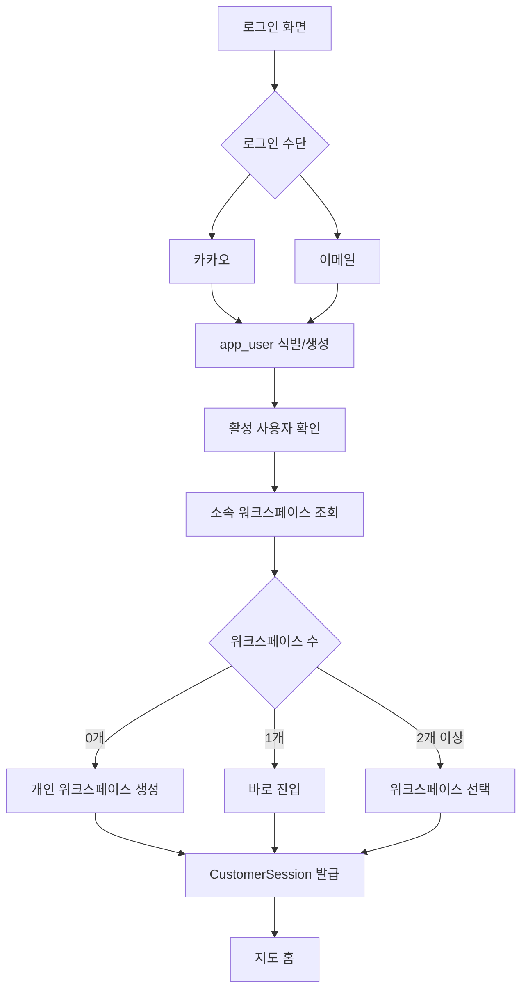

# MAJU 통합 로그인 설계

작성일: 2026-08-29  
목적: 카카오톡 로그인과 이메일 로그인을 하나의 사용자 체계로 통합하고, 개인/회사 워크스페이스와 권한을 명확히 분리한다.

## 1. 핵심 원칙

1. 로그인 수단과 사용자는 분리한다.
   - 카카오, 이메일, 네이버, 구글은 모두 `같은 사용자(app_user)`에 연결되는 인증 수단이다.
   - 사용자는 여러 로그인 수단을 가질 수 있다.

2. 사용자와 워크스페이스는 분리한다.
   - 한 사용자는 개인 워크스페이스를 가질 수 있다.
   - 한 사용자는 하나 이상의 회사 워크스페이스에 소속될 수 있다.
   - 로그인 직후에는 사용 가능한 워크스페이스를 확인하고, 하나를 선택하거나 기본 워크스페이스로 진입한다.

3. 권한은 회사 멤버십 기준으로 판단한다.
   - 권한은 사용자의 전역 속성이 아니라 `company_members.role` 기준이다.
   - 같은 사용자가 A회사에서는 `owner`, B회사에서는 `sales`일 수 있다.

4. 개인 사용과 회사 사용은 데이터 범위를 분리한다.
   - 개인 사용자는 개인 워크스페이스의 리드/거래처/활동만 본다.
   - 회사 사용자는 소속 회사의 데이터만 본다.

5. 실운영 로그인에는 개발용 계정을 노출하지 않는다.
   - `owner@maju.local`, `maju-owner-2026` 같은 개발 계정은 운영 UI에 표시하지 않는다.
   - 빠른 로그인은 로컬 개발 환경에서만 허용한다.

## 2. 현재 구현 기준

현재 코드에는 다음 구조가 존재한다.

| 영역 | 현재 상태 | 기준 파일 |
| --- | --- | --- |
| 이메일 고객사 로그인 | `auth_credentials` 기반으로 동작 | `lib/auth.ts`, `lib/store.ts`, `app/api/customer/login/route.ts` |
| 카카오 로그인 | 초대 코드가 있으면 회사 직원, 없으면 개인 워크스페이스 생성 | `app/api/auth/kakao/*`, `lib/store.ts` |
| 네이버/구글 로그인 | 카카오와 유사한 공용 OAuth 흐름 | `app/api/auth/naver/*`, `app/api/auth/google/*`, `lib/store.ts` |
| 사용자 테이블 | `app_users` 존재 | `supabase/schema.sql` |
| 회사 멤버십 | `company_members` 존재 | `supabase/schema.sql` |
| 권한 모델 | `owner`, `manager`, `sales`, `driver`, `member` | `lib/workspace.ts` |
| 세션 | `CustomerSession`에 회사/권한/워크스페이스 타입 저장 | `lib/auth.ts` |

현재 보완이 필요한 점:

| 항목 | 문제 |
| --- | --- |
| 이메일 로그인과 OAuth 사용자 통합 | 이메일 로그인은 `auth_credentials`, OAuth는 `app_users` 중심이라 기준이 분리됨 |
| 여러 회사 소속 | 현재 세션은 한 번에 하나의 `companyId`만 저장함 |
| 워크스페이스 선택 | 여러 개인/회사 워크스페이스가 있을 때 선택 화면이 명확하지 않음 |
| 계정 연결 | 같은 이메일로 카카오 로그인 후 이메일 로그인 계정과 연결하는 UX가 부족함 |
| 실운영 권한 관리 | 역할은 있으나 “제한”보다 “업무 구분/관리” 성격이 강함 |

## 3. 목표 IA

통합 로그인 이후 사용자는 다음 구조로 진입한다.

```text
로그인
  - 카카오로 계속하기
  - 이메일로 로그인
  - 회사 가입
  - 초대 링크로 직원 가입

워크스페이스 선택
  - 개인 워크스페이스
  - 회사 워크스페이스
    - 대표/소유자
    - 관리자
    - 영업직원
    - 배송기사
    - 일반직원

앱 진입
  - 지도 홈
  - 리드/거래처/코스/활동
```

## 4. 사용자 식별 모델

### 4.1 app_users

사용자 개인을 나타낸다.

| 필드 | 목적 |
| --- | --- |
| `id` | 사용자 고유 ID |
| `email` | 대표 이메일 |
| `phone` | 휴대폰 번호 |
| `name` | 표시 이름 |
| `kakao_user_id` | 카카오 계정 연결 |
| `naver_user_id` | 네이버 계정 연결 |
| `google_user_id` | 구글 계정 연결 |
| `auth_provider` | 최초/최근 가입 수단 |
| `avatar_url` | 프로필 이미지 |
| `last_login_at` | 최근 로그인 |
| `status` | active/inactive |

권장 추가 필드:

| 필드 | 목적 |
| --- | --- |
| `password_hash` | 이메일 로그인용 비밀번호 해시 |
| `email_verified_at` | 이메일 검증 시각 |
| `phone_verified_at` | 휴대폰 검증 시각 |
| `last_auth_provider` | 최근 로그인 수단 |

### 4.2 auth_identities

로그인 수단을 별도 테이블로 분리하는 것을 권장한다.

| 필드 | 목적 |
| --- | --- |
| `id` | 인증 수단 ID |
| `user_id` | 연결된 `app_users.id` |
| `provider` | kakao/email/naver/google |
| `provider_user_id` | 소셜 제공자 사용자 ID |
| `email` | 제공자가 준 이메일 |
| `created_at` | 연결 시각 |
| `last_used_at` | 마지막 사용 시각 |

이 테이블을 두면 카카오와 이메일을 같은 사용자로 묶기 쉽다.

### 4.3 companies

회사 또는 개인 워크스페이스의 컨테이너다.

| 타입 | 구분 |
| --- | --- |
| 개인 | `business_type = personal` 또는 별도 `workspace_type = personal` |
| 회사 | 일반 고객사 |

권장 추가 필드:

| 필드 | 목적 |
| --- | --- |
| `workspace_type` | personal/company |
| `billing_status` | 결제/플랜 상태 |
| `owner_user_id` | 대표 사용자 |

### 4.4 company_members

사용자와 워크스페이스의 관계 및 권한을 나타낸다.

| 필드 | 목적 |
| --- | --- |
| `company_id` | 소속 워크스페이스 |
| `user_id` | 사용자 |
| `role` | owner/manager/sales/driver/member |
| `status` | active/inactive/pending |
| `invited_email` | 초대 이메일 |

## 5. 로그인 플로우

### 5.1 이메일 로그인

```text
이메일/비밀번호 입력
→ app_users.email 조회
→ password_hash 검증
→ active 사용자 확인
→ company_members active 목록 조회
→ 워크스페이스 1개면 바로 진입
→ 여러 개면 워크스페이스 선택
→ CustomerSession 생성
```

단기 구현:

```text
현재 auth_credentials 로그인 유지
→ 로그인 성공 시 app_users/company_members와 동기화
→ 이후 app_users.password_hash 기반으로 전환
```

### 5.2 카카오 로그인

```text
카카오 OAuth 시작
→ 카카오 사용자 ID/이메일 조회
→ auth_identities(provider=kakao, provider_user_id) 조회
→ 있으면 기존 app_user로 로그인
→ 없고 동일 이메일 app_user가 있으면 계정 연결 확인
→ 없으면 신규 app_user 생성
→ 초대 코드가 있으면 회사 멤버로 연결
→ 초대 코드가 없으면 개인 워크스페이스 생성 또는 기존 워크스페이스 선택
```

### 5.3 초대 링크 가입

```text
관리자가 직원 초대 생성
→ 직원이 카카오/이메일로 가입
→ invite_code 검증
→ app_user 생성 또는 기존 사용자 연결
→ company_members 생성
→ role/status 저장
→ 모바일 현장 화면으로 진입
```

### 5.4 개인 사용자 가입

```text
카카오 또는 이메일로 가입
→ app_user 생성
→ personal 워크스페이스 생성
→ company_members(owner) 생성
→ 지도 홈 진입
```

### 5.5 회사 생성

```text
사용자가 회사 생성
→ 사업자번호 검증
→ companies 생성(workspace_type=company)
→ 현재 app_user를 owner로 company_members 연결
→ 회사 지도 홈 진입
```

## 6. 세션 설계

현재 `CustomerSession`은 유지하되 다음 의미를 명확히 한다.

| 필드 | 의미 |
| --- | --- |
| `email` | 로그인 사용자 이메일 |
| `name` | 로그인 사용자명 |
| `companyId` | 현재 선택된 워크스페이스 |
| `companyName` | 현재 워크스페이스명 |
| `workspaceType` | personal/company |
| `workspaceRole` | 현재 워크스페이스에서의 역할 |
| `role` | owner/member 호환 필드 |

권장 추가:

| 필드 | 의미 |
| --- | --- |
| `userId` | `app_users.id` |
| `memberId` | `company_members.id` |
| `authProvider` | 이번 로그인 수단 |

## 7. 권한 설계

역할은 “업무 구분”과 “관리 권한”을 함께 표현한다.

| 역할 | 기본 의미 | 권장 권한 |
| --- | --- | --- |
| owner | 회사 대표/소유자 | 전체 가능 |
| manager | 현장 관리자 | 직원/거래처/코스/리포트 관리 |
| sales | 영업직원 | 리드/거래처/영업활동/견적 |
| driver | 배송기사 | 코스/방문/배송증빙 |
| member | 일반직원 | 조회/기본 활동 |

사용자 요청 기준:

| 원칙 | 적용 |
| --- | --- |
| 역할별로 업무를 과도하게 막지 않는다 | 대부분 기능은 열어둔다 |
| 관리성 기능은 제한한다 | 직원 초대/비활성화/회사 설정은 owner/manager 중심 |
| 권한은 바꿀 수 있어야 한다 | 관리자가 역할과 상태를 수정 가능 |

## 8. 개인/회사 구분

| 구분 | 개인 | 회사 |
| --- | --- | --- |
| 생성 방식 | 소셜/이메일 가입 시 자동 생성 | 회사 가입 또는 초대 |
| 데이터 범위 | 개인 리드/거래처/활동 | 회사 공동 데이터 |
| 권한 | owner 고정 | owner/manager/sales/driver/member |
| 사용 화면 | 지도 홈 중심 | 지도 홈 + 운영/성장/관리 |
| 초대 | 선택 기능 | 핵심 기능 |

## 9. 계정 연결 정책

같은 사람이 여러 로그인 수단을 쓰는 경우:

```text
카카오 이메일 = 기존 app_users.email
→ "이미 이메일 계정이 있습니다. 카카오 계정을 연결할까요?"
→ 이메일 비밀번호 또는 메일 인증으로 본인 확인
→ auth_identities에 kakao 추가
```

이메일이 없는 카카오 계정:

```text
카카오 ID 기준으로 app_user 생성
→ 이메일 미확인 상태
→ 앱 진입 후 이메일 추가 요청
```

동일 카카오 ID가 다른 회사 초대를 받는 경우:

```text
기존 app_user 재사용
→ 새 company_members만 추가
→ 로그인 후 워크스페이스 선택
```

## 10. 실운영 서버 체크리스트

| 항목 | 필요 조치 |
| --- | --- |
| 개발용 계정 제거 | 운영 UI와 자동 로그인에서 `owner@maju.local` 노출 금지 |
| 비밀번호 저장 | 평문 금지, `password_hash`만 저장 |
| 세션 시크릿 | `ADMIN_SESSION_SECRET` 필수 |
| 고객사 상태 | inactive/suspended 회사 로그인 차단 |
| 사용자 상태 | inactive 사용자 로그인 차단 |
| 멤버 상태 | inactive/pending 멤버 워크스페이스 진입 차단 |
| 이메일 중복 | 전역 사용자 기준 중복 방지 |
| 소셜 ID 중복 | provider별 unique index |
| RLS | 회사별 데이터 접근 분리 |
| 감사 로그 | 로그인, 초대, 권한 변경 기록 |
| 비밀번호 재설정 | 토큰 해시 저장, 만료시간 필수 |

## 11. 단계별 구현 계획

### 1단계: 운영 안전화

- 로그인 화면 개발용 계정 제거
- 최근 로그인은 실제 성공한 이메일만 표시
- 고객사 상태가 active가 아니면 로그인 차단
- 고객사 생성 시 `app_users/company_members` 동기화

### 2단계: 사용자 중심 로그인 전환

- `app_users.password_hash` 추가
- 이메일 로그인 기준을 `auth_credentials`에서 `app_users`로 이동
- `auth_credentials`는 관리자 초기 호환용으로만 축소
- 로그인 성공 시 `last_login_at` 갱신

### 3단계: 인증 수단 통합

- `auth_identities` 추가
- 카카오/네이버/구글 provider 연결을 공통화
- 동일 이메일 계정 연결 UX 추가
- 이메일 없는 소셜 계정의 이메일 추가 UX 추가

### 4단계: 워크스페이스 선택

- `/workspaces` 화면 추가
- 개인/회사 워크스페이스 목록 표시
- 최근 사용 워크스페이스 저장
- 여러 회사 소속 시 선택 후 세션 재발급

### 5단계: 권한 관리 고도화

- 회사 설정의 직원 목록을 `company_members + app_users` 기준으로 정리
- 역할 변경, 비활성화, 초대 재발송
- 관리 권한과 업무 역할 분리
- 감사 로그 강화

## 12. 권장 DB 마이그레이션 초안

```sql
alter table public.app_users
  add column if not exists password_hash text,
  add column if not exists email_verified_at timestamptz,
  add column if not exists phone_verified_at timestamptz,
  add column if not exists last_auth_provider text;

alter table public.companies
  add column if not exists workspace_type text not null default 'company',
  add column if not exists owner_user_id uuid references public.app_users(id) on delete set null;

create table if not exists public.auth_identities (
  id uuid primary key default gen_random_uuid(),
  user_id uuid not null references public.app_users(id) on delete cascade,
  provider text not null,
  provider_user_id text not null,
  email text,
  created_at timestamptz not null default now(),
  last_used_at timestamptz,
  unique(provider, provider_user_id)
);

create unique index if not exists idx_app_users_email_lower
  on public.app_users (lower(email))
  where email is not null;

create index if not exists idx_company_members_user_status
  on public.company_members(user_id, status);

create index if not exists idx_company_members_company_status_role
  on public.company_members(company_id, status, role);
```

## 13. 최종 목표 플로우



## 14. 결론

MAJU의 통합 로그인은 `로그인 수단(provider)` 중심이 아니라 `사용자(app_users)` 중심으로 가야 한다.  
카카오와 이메일은 같은 사용자를 확인하는 방법이고, 개인/회사 구분과 권한은 `company_members`에서 결정해야 한다.

운영 안정성을 위해 단기적으로는 기존 `auth_credentials`를 유지하되, 신규 가입/어드민 생성 계정은 반드시 `app_users`와 `company_members`에도 연결한다. 이후 이메일 로그인도 `app_users.password_hash` 기준으로 이전하면 카카오/이메일/회사초대/개인사용이 하나의 계정 체계로 정리된다.
